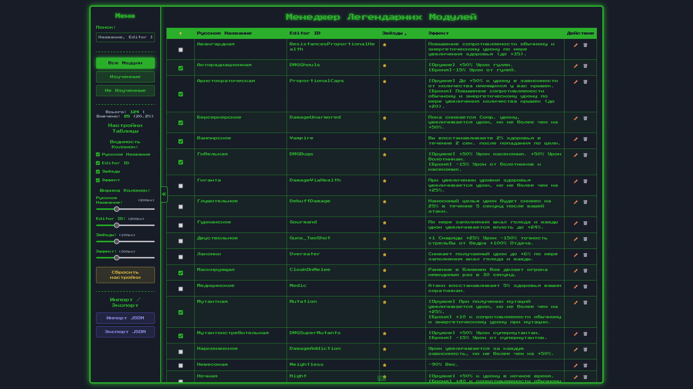
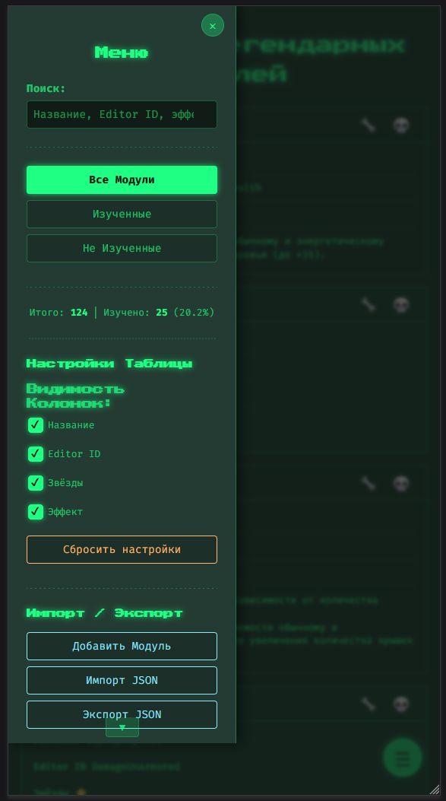

# Fallout 76 Legendary Modules Manager ☢️

[](https://smyhlin.github.io/fallout-mods-manager/) [](LICENSE.md)

A **Pip-Boy** themed React single-page application to track and manage your learned legendary modules in Fallout 76—no build step or backend required, runs entirely in your browser.

## Table of Contents

- [Demo](#demo)
- [Features](#features)
- [Installation](#installation)
- [Usage](#usage)
- [Configuration](#configuration)
- [Screenshots](#screenshots)
- [Technology Stack](#technology-stack)
- [Contributing](#contributing)
- [License](#license)

## Demo

Try it live: https://smyhlin.github.io/fallout-mods-manager/

## Features

- **Comprehensive Database**: Preloaded 1★–4★ legendary modules with Russian names, Editor IDs, and effects.
- **Learned Status**: Mark/unmark modules as learned with a checkbox.
- **Custom Modules**: Add, edit, or delete modules (core names/stars remain locked).
- **Filter/Sort/Search**: Instant text search with highlights; sort by any column; filter by status.
- **Responsive UI**: Desktop table view & mobile-friendly card view.
- **Customizable Table**: Toggle column visibility and adjust widths via sidebar.
- **Import/Export**: Backup or restore your data as JSON.
- **Statistics Dashboard**: Track total modules, learned count, and percentage learned.
- **Offline-First**: All data persisted in `localStorage`.

## Installation

```bash
git clone https://github.com/smyhlin/fallout-mods-manager.git
cd fallout-mods-manager
# No build required
open index.html in your browser
```

> **Note**: React, ReactDOM, PropTypes, and Babel Standalone are loaded via CDN.

## Usage

1. **Mark Modules**: Click the 💡 checkbox to mark modules as learned.
2. **Filter & Sort**: Use sidebar controls to filter by learned status or search text.
3. **Customize View**: Collapse sidebar with ⚙️ and toggle column visibility.
4. **Add/Edit/Delete**: Use the form at the bottom or the ✏️/🗑️ icons next to each module.
5. **Import/Export**: Use sidebar buttons to download or upload your JSON backup.

## Configuration

- Customize initial learned modules in `config.js`.
- Adjust table columns (visibility, width, sortable) in `config.js`.

## Screenshots

### Desktop Table View



### Mobile Card View



## Technology Stack

- **React v18** & **Babel Standalone** (JSX in-browser)
- **PropTypes** for runtime prop validation
- **HTML5** & **CSS3** (Flexbox, Grid, Media Queries)
- **Browser `localStorage`** for data persistence

## Contributing

Contributions, issues, and feature requests are welcome! Please open an issue or submit a pull request at [https://github.com/smyhlin/fallout-mods-manager](https://github.com/smyhlin/fallout-mods-manager).

## License

This project is licensed under the [MIT License](LICENSE.md).
