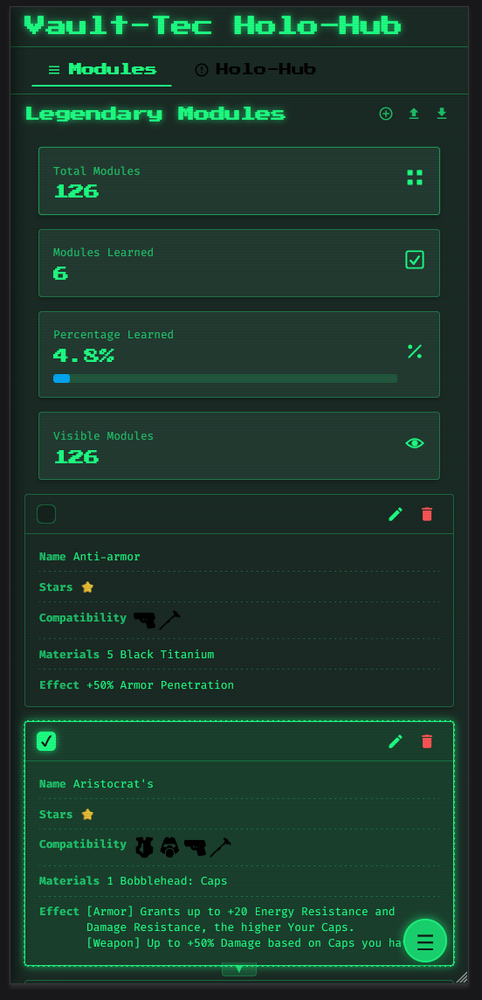

# Fallout Mods Manager & Player Toolkit

Welcome to the Fallout Mods Manager & Player Toolkit! This web application is designed to enhance your Fallout gaming experience by providing a suite of tools, including a functional mod checklist/organizer, a visual guide for a tier list concept, a critical hit calculator, and more. The application supports multiple languages for a broader audience.

## 🚀 Key Features

* **📝 Mod Checklist/Organizer:**
    * Manage and track your Fallout mods.
    * Mark mods as known, learned, or active using a checklist format.
    * Allows for basic organization and overview of your mod setup.
* **🏆 Tier List Visual Guide (Static Display):**
    * Presents a static visual example of how a tier list for various Fallout items (e.g., weapons, armor, perks, companions) could be structured.
    * Serves as a visual reference or mock-up of a potential tier list layout.
    *(Note: This section is a non-interactive display for illustrative purposes only. It does not allow for creating, editing, or interacting with tier list elements.)*
* **💥 Critical Hit Calculator:**
    * Optimize your build for maximum critical damage.
    * Input your S.P.E.C.I.A.L. stats, perks, weapon modifications, and consumables.
    * See detailed calculations for critical chance and damage output.
* **🌍 Multi-language Support:**
    * Currently supports English, Russian, and Ukrainian.
    * Easily switch languages through the application settings.
* **🎨 User-Friendly Interface:** Clean, intuitive, and responsive design for a seamless experience on desktop and mobile devices.
* **⚙️ Customizable:** Tailor tools to your specific Fallout version or playstyle.

---


<p align="center">
    
</p>

---

## 🛠️ Tech Stack

* **Frontend:** React, JavaScript (ES6+)
* **State Management:** React Context API
* **Styling:** CSS3, HTML5
* **Localization:** Custom solution using JSON files.

## ⚙️ How to Run

This application is designed to be plug-and-play. No complex installation is needed.

1.  **Download or Clone the Repository:**
    * You can download the project files as a ZIP archive and extract them to a folder on your computer.
    * Alternatively, if you have Git installed, you can clone the repository:
        ```bash
        git clone https://your-repository-url/fallout-mods-manager.git
        cd fallout-mods-manager
        ```

2.  **Serve `index.html` via an HTTP Server:**
    * To ensure all features, especially language localization from local JSON files, work correctly, you need to serve the `index.html` file through a simple HTTP server. Opening `index.html` directly from your file system (e.g., `file:///...`) might lead to issues due to browser security policies (CORS).
    * Here are a few common ways to do this:
        * **Using Python (if installed):**
            Open your terminal or command prompt, navigate to the project's root directory (where `index.html` is located), and run one of the following commands:
            * For Python 3: `python -m http.server`
            * For Python 2: `python -m SimpleHTTPServer`
            Then, open your web browser and go to `http://localhost:8000` (or the port number shown in the terminal).
        * **Using VS Code with the "Live Server" Extension:**
            If you use Visual Studio Code, you can install the "Live Server" extension. Once installed, right-click on the `index.html` file in the VS Code explorer and select "Open with Live Server."
        * **Using `npx serve` (if you have Node.js/npm installed for other development purposes):**
            Open your terminal, navigate to the project's root directory, and run:
            ```bash
            npx serve
            ```
            Then, open the URL provided in the terminal (usually `http://localhost:3000` or `http://localhost:5000`).
        * **Other HTTP Server Tools:** Many other simple static file server tools are available.

Once the server is running, navigate to the provided local URL in your web browser to use the application.

## 📖 How to Use

### General Navigation
* The application features a sidebar or main navigation menu to switch between different tools (Mod Checklist/Organizer, Tier List Visual Guide, Crit Calculator).
* Language settings can usually be found in a dedicated settings menu or a language switcher component.

### Tier List Visual Guide (Static Display)
1.  Navigate to the "Tier List" section.
2.  Observe the static visual example of a tier list layout.
    *(Note: This section is for viewing purposes only. No interactions are available.)*

### Critical Hit Calculator
1.  Navigate to the "Crit Calculator" section.
2.  Enter your character's relevant S.P.E.C.I.A.L. stats.
3.  Select active perks that influence critical hits.
4.  Input details about your equipped weapon and its modifications.
5.  Add any active chems or consumables.
6.  The calculator will display your critical hit chance and potential damage.

### Mod Checklist/Organizer
1.  Navigate to the "Mod Checklist" or "Mod Organizer" section.
2.  View and interact with the list of mods.
3.  Use the checkboxes or other provided UI elements to manage your mod list (e.g., mark as learned, active, etc.).

## 🌐 Localization

The application supports multiple languages. You can switch the display language through the settings panel. If you'd like to contribute translations for a new language:
1.  Fork the repository.
2.  Duplicate the `locales/en.json` (and `en_modules.json` if applicable) file and rename it to your language code (e.g., `de.json` for German).
3.  Translate the values in your new JSON file.
4.  Update the language context and language switcher component to include the new language.
5.  Submit a pull request with your changes.

## 🤝 Contributing

Contributions are welcome and greatly appreciated! If you have suggestions for improvements, new features, or bug fixes, please follow these steps:

*(Note: The application is completely self-contained and requires no build tools or dependencies. You only need a basic HTTP server to run it locally or GitHub Pages for hosting.)*

1.  **Fork the Project.**
2.  **Create your Feature Branch:** (`git checkout -b feature/AmazingFeature`)
3.  **Commit your Changes:** (`git commit -m 'Add some AmazingFeature'`)
4.  **Push to the Branch:** (`git push origin feature/AmazingFeature`)
5.  **Open a Pull Request.**

Please ensure your code adheres to the existing style and that any new features are well-documented.

## 📜 License

Distributed under the MIT License. See `LICENSE.txt` for more information.

## 🙏 Acknowledgements

* To the Fallout community for their endless creativity and passion.
* Any libraries or assets used that require attribution.

---

We hope this toolkit helps you get the most out of your adventures in the wasteland!

