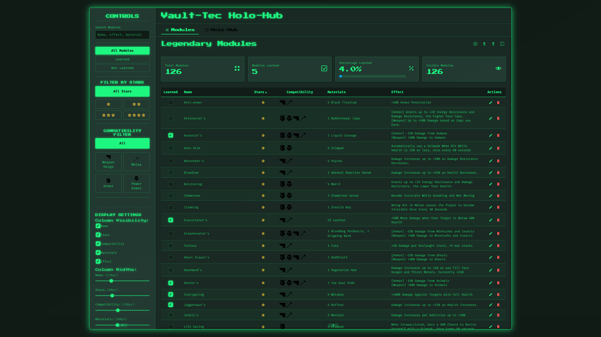

# Fallout 76 Legendary Modules Manager ☢️

**A Pip-Boy themed web application to track your learned legendary modules in Fallout 76.**

This tool helps Fallout 76 players manage their legendary modules. It provides a simple, efficient, and thematic way to track which modules you have learned across characters and remember their effects, all within your browser.

---

## ✨ Live Demo

Access the live application hosted on GitHub Pages:

**[➡️ Live Application](https://smyhlin.github.io/fallout-mods-manager/)**

---

## 🚀 Features

*   **Comprehensive Module Database:** Includes a pre-populated list of 1-star, 2-star, 3-star, and 4-star legendary modules with Russian names, Editor IDs, and effects.
*   **Learned Status Tracking:** Mark modules as "learned" or "not learned" using checkboxes.
*   **Custom Module Management:**
    *   Add new modules not present in the default list.
    *   Edit the Editor ID and Effect of any module (predefined module names and stars are locked).
    *   Delete any module (predefined or custom).
*   **Filtering & Sorting:**
    *   Filter the list to show "All", "Learned", or "Not Learned" modules.
    *   Sort the list by clicking column headers (Learned Status, Russian Name, Editor ID, Stars, Effect).
*   **Text Search:** Quickly filter modules by searching for text within Russian Name, Editor ID, or Effect fields. Matching text is highlighted.
*   **Responsive Design:**
    *   Desktop view features a classic table with customizable columns.
    *   Mobile view adapts to a user-friendly "Card View".
*   **Customizable View (Desktop):** Toggle column visibility and adjust column widths via sidebar settings. Settings are saved locally.
*   **Collapsible Sidebar (Desktop):** Hide the sidebar to maximize space for the module list.
*   **Data Persistence:** Module learned status, custom modules, and view settings are automatically saved in the browser's `localStorage`.
*   **Import/Export:** Backup your data to a JSON file or import data from a previous export.
*   **Statistics:** View a summary of total modules, learned count, and percentage learned in the sidebar.
*   **Pip-Boy Theme:** The application is styled to resemble the iconic Fallout Pip-Boy interface.

---

## 📸 Screenshots

**Desktop View:**

**Mobile Card View:**

**Edit Modal:**

---

## 🛠️ Technology Stack

*   **HTML5**
*   **CSS3:** Custom Pip-Boy theme, responsive design (Flexbox, Grid, Media Queries), animations.
*   **JavaScript (ES6+):** Core application logic.
*   **React (v18):** UI library (loaded via CDN).
*   **Babel Standalone:** Transpiles JSX in the browser (loaded via CDN).
*   **Browser `localStorage`:** Client-side data persistence.

---

## 💡 How to Use

1.  **Access the application:** Simply open the [Live Demo link](https://smyhlin.github.io/fallout-mods-manager/) provided above.
2.  **Mark modules:** Use the checkbox (💡) in the first column (or at the top of the card on mobile) to mark modules as learned.
3.  **Filter/Sort/Search:** Use the controls in the sidebar (accessible via the ⚙️ button on mobile) to filter, sort, and search the module list.
4.  **Customize View:** Adjust column visibility and width (on desktop) via the sidebar settings.
5.  **Add/Edit/Delete:** Use the form at the bottom to add new modules, or use the ✏️/🗑️ icons next to each module (in the "Дії" column on desktop, or top-right on mobile cards) to edit or delete.
6.  **Import/Export:** Use the buttons in the sidebar to save your data to a file or load data from a backup.

**Important Note:** All data is stored **locally in your browser's `localStorage`**. Clearing your browser data will erase your saved modules and settings. Use the Export feature to create backups. Data is not shared between different browsers or devices.

---

## 🔮 Future Improvements (Ideas)

*   User accounts and cloud synchronization (would require a backend).
*   Ability to track modules per character.
*   More detailed filtering options (e.g., by weapon/armor type if data allows).

---

## 🤝 Contributing

Contributions, issues, and feature requests are welcome! Feel free to check [issues page](https://github.com/smyhlin/fallout-mods-manager/issues).

---

## 📄 License

This project is open source and available under the [MIT License](LICENSE.md). <!-- Create a LICENSE.md file if you choose one -->
